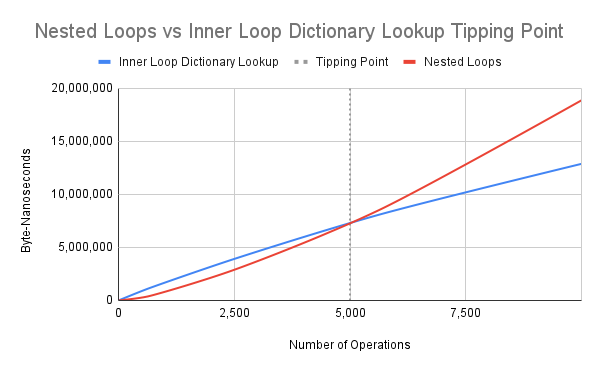

# .NET Benchmarks

A repository with .NET benchmark experiments using [BenchmarkDotNet](https://github.com/dotnet/BenchmarkDotNet). A great video tutorial introduction to BenchmarkDotNet by Tim Corey can be found on YouTube [here](https://youtu.be/mmza9x3QxYE).

## Usage

To run from Visual Studio:

1. Open the solution in Visual Studio.
2. Switch the build to `Release`.
3. Press `ctrl-F5` to Start Without Debugging.

## Experiments

Experiments are comparisons of 2 or more benchmarks.

### Collections

#### Lists

| Experiment                                                   | Conclusion                                                   |
| ------------------------------------------------------------ | ------------------------------------------------------------ |
| [List vs Linked List: Append](./Benchmarks/Collections/Lists/Results/Benchmarks.Collections.Lists.ListAppendBenchmarks-report-github.md) | List is faster to build and consumes less memory than Linked List. This is true even when the List capacity is not known ahead of time. |

#### Dictionaries

| Experiment                                                   | Conclusion                                                   |
| ------------------------------------------------------------ | ------------------------------------------------------------ |
| [Nested Loops vs Inner Loop Dictionary Lookup](./Benchmarks/Collections/Dictionaries/Results/Benchmarks.Collections.Dictionaries.NestedLoopsBenchmarks-report-github.md) |  At 5,000 operations an inner loop dictionary lookup runs more efficiently as measured in byte-nanoseconds. The square root of 5,000 is ~70. Some factors of 5,000 are: 50 and 100, 20 and 250, 10 and 500, 8 and 625, etc. |